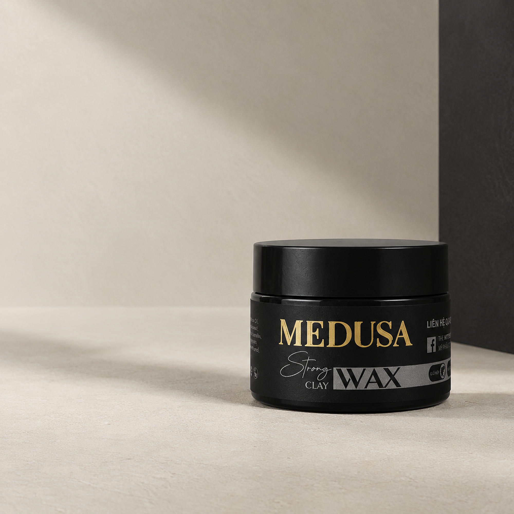

# The Mythos — Medusa Clay Wax | KOC Campaign Landing Page

Landing Page truyền thông và cung cấp brief chiến dịch hợp tác cho **KOC / KOL TikTok** gắn giỏ hàng sản phẩm **Medusa Strong Clay Wax** của thương hiệu mỹ phẩm nam **The Mythos**.



---

## 🎯 Mục Tiêu Chiến Dịch
- Tuyển chọn và đồng hành cùng các Creator/KOC nam giới (hoặc review lifestyle/grooming).
- Cung cấp brief ngắn gọn, rõ ràng theo đúng tinh thần: **"Tóc mỏng + nhanh dầu → Medusa"**.
- Chính sách hoa hồng hấp dẫn: **10% - 15%** theo hiệu suất đơn hàng qua TikTok Shop.
- Cam kết tài trợ ngân sách chạy **TikTok Spark Ads** trên video của Creator để bùng nổ traffic và doanh thu.
- Tặng mẫu sáp full-box 0đ tận tay Creator để trải nghiệm thực tế.

---

## 💎 Điểm Nhấn Thương Hiệu & Proof of Authority
- **20.000+** sản phẩm đã bán ra trên thị trường.
- **9 Năm** kinh nghiệm chế tác & R&D (từ phòng lab độc lập năm 2017).
- **25+** Đại lý bán lẻ & Barbershop uy tín toàn quốc.
- **4.9 / 5.0 ★** Đánh giá thực tế trên các nền tảng online.

---

## ⚡ 5 Hướng Kịch Bản Sáng Tạo Cho Creator
1. **Tóc vuốt xong bị bết**: Xoáy sâu vào vấn đề da đầu dầu làm xẹp tóc sau vài tiếng &rarr; Medusa hút dầu giữ phồng.
2. **Tóc mỏng muốn phồng**: Sai lầm dùng sáp nặng gây sụp chân tóc &rarr; Medusa chất sáp siêu nhẹ nâng phồng.
3. **Thử thách mũ bảo hiểm xe máy**: Nỗi khổ đi xe máy nóng bí &rarr; Tháo mũ cào tay 3 giây là về lại form.
4. **Test thực tế 10 tiếng**: Video không khen quá đà, quay mốc thời gian thực từ 8h sáng đến 18h tối.
5. **Đánh giá cá nhân / Q&A**: Trả lời thật lòng về độ bám nếp, mùi hương gỗ trầm và khả năng gội sạch bằng nước 100%.

---

## 🛠️ Công Nghệ Sử Dụng
- **HTML5 Semantic & SEO Ready**: Cấu trúc rõ ràng, hỗ trợ đầy đủ OpenGraph meta tags.
- **CSS3 Modern Design System**: Bảng màu Light Mode sang trọng (*Warm off-white, stone, muted gray, obsidian charcoal, packaging gold*), typography chuẩn **Montserrat**.
- **Responsive Web Design**: Tối ưu hiển thị mượt mà trên Mobile (375px+), Tablet và Desktop.
- **Vanilla JavaScript ES6+**:
  - Interactive Tab Switcher cho 5 hướng kịch bản.
  - Interactive Revenue & Commission Calculator (10-15% + Spark Ads bonus).
  - Copy-to-clipboard Brief bỏ túi tức thì kèm Toast notification.
  - Form đăng ký nhận mẫu thử tích hợp Modal thông báo chuyên nghiệp.

---

## 📁 Cấu Trúc Thư Mục
```
.
├── assets/
│   ├── product-hero.png       # Ảnh chụp studio sản phẩm hũ sáp Medusa
│   ├── product-wood.jpg       # Ảnh nghệ thuật sản phẩm trên gỗ hun khói
│   ├── creator-tiktok.jpg     # Ảnh creator quay video TikTok vuốt sáp
│   ├── hair-texture.jpg       # Ảnh cận cảnh form tóc phồng tơi mờ tự nhiên
│   ├── helmet-restyle.jpg     # Ảnh tháo mũ bảo hiểm xe máy vuốt lại tóc
│   └── lab-craft.jpg          # Ảnh bàn chế tác lab sáp đất sét từ 2017
├── index.html                 # Trang landing page chính
├── style.css                  # Toàn bộ stylesheet giao diện & responsive
├── script.js                  # Xử lý logic tương tác người dùng
├── .gitignore                 # Bỏ qua các file tạm không cần thiết
└── README.md                  # Tài liệu giới thiệu dự án
```

---

## 🚀 Hướng Dẫn Chạy Dự Án
1. Clone repository về máy:
   ```bash
   git clone https://github.com/balongpro/the-mythos-landing.git
   ```
2. Mở trực tiếp file `index.html` trên bất kỳ trình duyệt web nào (Chrome, Edge, Safari...).

---
&copy; 2017 - 2026 **The Mythos Co., Ltd.** Tất cả quyền được bảo lưu.
